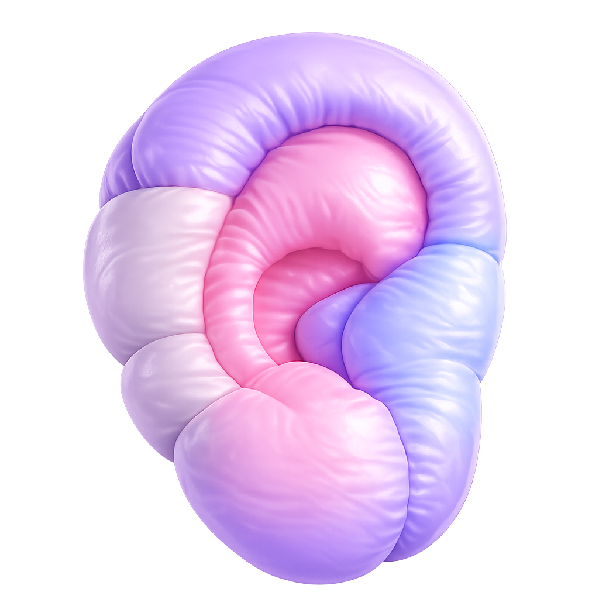

<p align="center">
  
</p>

# Ucho

A lightweight tool for capturing user feedback with screenshots, annotations, and debug information. Built with Solid.js and designed to seamlessly integrate into any web application.

## Features

- **Screenshot Capture**: Automatically capture the current page state
- **Drawing Tools**: Annotate screenshots with rectangles and freehand paths in multiple colors
- **Custom Inputs**: Add your own form fields (text, textarea, select, radio, checkbox)
- **Customizable UI**: Configurable colors, position, and text
- **Framework Agnostic**: Works with any web application
- **Easy Integration**: Simple setup with NPM or direct script inclusion
- **Rich Metadata**: Captures browser info, network info, location, timezone, and console entries

## Usage

### Using as an NPM Package

```typescript
import { init } from '@contember/ucho'

init({
  onSubmit: async (data) => {
    console.log('Feedback submitted:', data)
  }
})
```

### Using Directly in HTML

```html
<script type="module">
  import { init } from 'https://esm.sh/@contember/ucho'

  init({
    onSubmit: async (data) => {
      console.log('Feedback submitted:', data)
    }
  })
</script>
```

### Using with React

```tsx
import { init } from '@contember/ucho'
import { useEffect, useRef } from 'react'
import type { Config } from '@contember/ucho'

function useUcho(config: Config) {
  const cleanupRef = useRef<(() => void) | null>(null)

  useEffect(() => {
    cleanupRef.current = init(config)
    return () => {
      cleanupRef.current?.()
      cleanupRef.current = null
    }
  }, [config])
}
```

## Configuration Options

| Option | Type | Required | Default | Description |
|--------|------|----------|---------|-------------|
| `onSubmit` | `(data: FeedbackPayload) => Promise<Response \| void>` | Yes | - | Callback function when feedback is submitted. Return a `Response` to enable success/error notifications |
| `position` | `'top-left' \| 'top-right' \| 'bottom-left' \| 'bottom-right'` | No | `'bottom-right'` | Widget position on the page |
| `primaryColor` | `` `#${string}` `` | No | `'#6227dc'` | Primary color for UI elements |
| `textConfig` | `Partial<TextConfig>` | No | English defaults | Customize all text elements in the interface |
| `customInputs` | `CustomInputConfig[]` | No | `[]` | Custom input fields added to the feedback form |
| `disableMinimization` | `boolean` | No | `false` | Disable the launcher button minimization after inactivity |

### Custom Inputs

You can add custom form fields to the feedback form:

```typescript
init({
  onSubmit: async (data) => { /* ... */ },
  customInputs: [
    {
      id: 'category',
      type: 'select',
      label: 'Category',
      options: [
        { value: 'bug', label: 'Bug Report' },
        { value: 'feature', label: 'Feature Request' },
      ],
    },
    {
      id: 'mood',
      type: 'radio',
      label: 'How are you feeling?',
      options: [
        { value: 'happy', label: 'Happy' },
        { value: 'neutral', label: 'Neutral' },
        { value: 'frustrated', label: 'Frustrated' },
      ],
    },
  ],
})
```

Supported input types: `text`, `textarea`, `select`, `radio`, `checkbox`.

## Feedback Payload Structure

The `onSubmit` callback receives a `FeedbackPayload` object:

```typescript
type FeedbackPayload = {
  message: string              // User's written feedback
  screenshot?: string          // Base64 encoded PNG screenshot
  customInputs?: Record<string, string | string[]>
  metadata: {
    userAgent: string
    browserInfo: {
      width: number            // Viewport width
      height: number           // Viewport height
      screenWidth: number
      screenHeight: number
      language: string
      languages: readonly string[]
      doNotTrack: string | null
      cookiesEnabled: boolean
      hardwareConcurrency: number
      deviceMemory?: number
      maxTouchPoints: number
      colorDepth: number
      pixelRatio: number
      availableWidth: number
      availableHeight: number
    }
    networkInfo: {
      effectiveType?: string
      downlink?: number
      rtt?: number
      saveData?: boolean
    }
    locationInfo: {
      url: string
      origin: string
      pathname: string
      searchParams: Record<string, string>
      referrer: string
    }
    timeInfo: {
      timezone: string
      localDateTime: string
    }
    console: Array<{
      type: 'log' | 'warn' | 'error'
      message: string
      timestamp: string
    }>
  }
}
```

## License

Apache-2.0 - see [LICENSE](LICENSE) for details.
